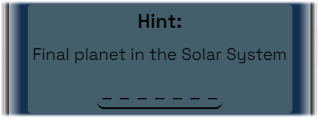

# **Word Guesser** 

 **Visit [Word Guesser](https://stojj2.github.io/Portfolio-Project-2/)**

## **Purpose** 
Word Guesser is a word game that aims to make the user learn new things in different subject categories. This game is a fun and competitive way to learn new things.

## **User Stories** 
- As a visiting user, I would like to play something with words.
- As a visiting user, I want to be encouraged to learn something new. 
- As a visiting user, I would like to have instructions on how to use the game.

## **Features** 

- ### Header area 
  
  - Gives a clear title with the name of the game

- ### Category area 
  
  - Category section with the option to choose between two different word categories

- ### Game Area 
  
  - Game area that is easy to understand.
  - In the game area there will be boxes for:
    - Guesses left
    - Hints
    - Word length in the form of underscores
    - Input field for guesses
    - Submit button for submitting the guess  
  - The input box and send button will be grayed out when the game is not started or if the game is over.
  - As soon a category is chosen the game area will be loaded with new content.

- ### Instruction area
  
  - Instruction area will provide the user with four easy steps how to play the game.

- ### Footer area 
  
  - Footer section is the last section of the game site and do provide social media links to the game creator.
  

- ### Responsive Design 
  - The game will be playable on different screens sizes, Phon, tablet and desktop. 

## **Future Features** 
- Adding more word categories to the game.

## **Fonts and color** 
 - Color - C3B895, 143051, 425F6B
 - Font - Space Grotesk
 - The font for the entire webpage is [Space Grotesk](https://fonts.google.com/specimen/Space+Grotesk)

## **Wireframe** 

  - **Game site**  
    
    

## **Testing** 

### **Code validation**
- W3C HTML Validator 
  
- W3C CSS Validator 

- Lighthouse desktop 

- Lighthouse mobile 

- jshint

### **Test cases** 
  

  - **`As a visiting user, I would like to play something with words.`** 
    - The game will have two different categories with words and will randomly chose a word for every game.

  - **`As a visiting user, I want to be encouraged to learn something new.`**
    -  The hint area is intended to give the user help on the way to being able to guess the word. Hints are also a way to teach the user something about the word that helps to remember something about the word until the next time it appears. 
      
        

  - **`As a visiting user, I would like to have instructions on how to use the game.`**
    - On the bottom of the page instruction is provided in a 4 step how-to-play guide.
      
   **Supported screens and browsers**
  - For this web page different screen sizes were tested and no errors were found. This specific sizes were validated
    - **Desktop** 1920×1080
      - For this resolution the media query will style the website with new style
    - **Tablet** 768x1024
    - **Mobile** 360x640
  - Browsers 
    - Google Chrom
      

### Fixed bugs 
 - One bug where found and fixed.
    - When guesses left is at 0 the game is supposed to end, however the bug did allowed the user to make 1 more guess.
    This was fixed with rearranging a if statement. The new if statement will check guesses left after it has decresed the guessing count.
 
### Unfixed bugs
 - If a user is doing a blank space in the input field when guessing a word the code logic will not be able to handle that today and will se it as the wrong answer eaven if the word guessed is right.

## Technology 
  - **Balsamiq**
    - Balsamiq Wireframes where used to draw wireframes for this project
  - **GitPod**
    - GitPod where used for writing all code 
  - **GitHub**
    - For storing the code GitHub where used
  - **GitHub Pages**
    - GitHub pages where used for hosting the website
  - **Chrome DevTools**
    - Google chrom built in devtools where used for testing 
  - **Mobile FIRST**
    - Mobile First Chrome extension where used for screenshots

## **Deployment**
 ### GitHub Pages
- The site was deployed to GitHub pages. The steps to deploy are as follows:
- In the GitHub repository, navigate to the Settings tab
- From the source section drop-down menu, select the Master Branch
- Once the master branch has been selected, the page will be automatically refreshed with a detailed ribbon display - to indicate the successful deployment.
The live link can be found here - https://stojj2.github.io/Portfolio-Project-2/index.html

 ### GitPod
  - The site was coded using GitPod. The steps to deploy is as following:
  - In the GitHub repository, press the green GitPod button for transfer the project to GitPod enviroment
    - NOTE!
      - [GitPod webbrowser plugin](https://chrome.google.com/webstore/detail/gitpod-always-ready-to-co/dodmmooeoklaejobgleioelladacbeki) needs to be installed to your browser to get this button. 
## **Credit**

  ### Media
 - On this website icons from [Fontawesome](https://fontawesome.com/start) where used
 - Font [Space Grotesk](https://fonts.google.com/specimen/Space+Grotesk) is from Google fonts

  ### Other
  - Very Much inspiration came from Code Institutes [Love Running](https://github.com/Code-Institute-Solutions/love-running-2.0-sourcecode) project. The HTML code was in great help for implementing the sign-up form in this website

  - Code Institute student [template](https://github.com/Code-Institute-Org/gitpod-full-template) for Gitpod was used for this project

  - Mentor **Rohit Sharma** helped me alot in this project for pointing my focus in the right direction
  - Slack forum for support. Cred to *peer-code-review* channel on slack for reviewing and feedback my project

