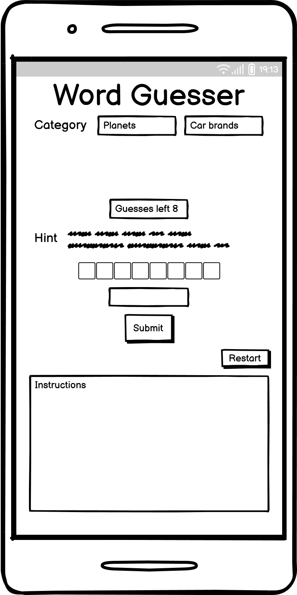

# **Word Guesser** 

 **Visit [Word Guesser](https://stojj2.github.io/Portfolio-Project-2/)**

## **Purpose** 
Word Guesser is a word game that aims to make the user learn new things in different subject categories. This game is a fun and competitive way to learn new things.

## **Features** 

- ### Header area 
  
  - Gives a clear title with the name of the game
  - Navigation button to instruction section

- ### Category area 
  
  - Category section with the option to choose between two different word categories

- ### Game Area 
  
  - Game area that is easy to understand.
  - In the game area there will be boxes for:
    - Guesses left
    - Hints
    - Word length in the form of underscores
    - Input field for guesses
    - Submit button for submitting the guess  
  - The input box and submit button will be grayed out when the game is not started or if the game is over.
  - As soon a category is chosen the game area will be loaded with new content.

- ### Instruction area
  
  - Instruction area will provide the user with four easy steps how to play the game.

- ### Footer area 
  
  - Footer section is the last section of the game site and do provide social media links to the game creator.
  

- ### Responsive Design 
  - The game will be playable on different screens sizes, Phone, tablet and desktop. 

## **Future Features** 
- Adding more word categories to the game.

## **Fonts and color** 
 - Color - C3B895, 143051, 425F6B
 - Font - Space Grotesk
 - The font for the entire webpage is [Space Grotesk](https://fonts.google.com/specimen/Space+Grotesk)

## **Wireframe** 

  - **Game site**  
    
    

## **Testing** 

### **Code validation**
- W3C HTML Validator 
  - [index.html](https://validator.w3.org/nu/?doc=https%3A%2F%2Fstojj2.github.io%2FPortfolio-Project-2%2F)
  
- W3C CSS Validator 
  - [style.css](https://jigsaw.w3.org/css-validator/validator?uri=https%3A%2F%2Fstojj2.github.io%2FPortfolio-Project-2%2F&profile=css3svg&usermedium=all&warning=1&vextwarning=&lang=sv)

- Lighthouse desktop 
  - 

- Lighthouse mobile 
  - 

- jshint script.js
  - The undefined variables are defined in the words.js file.
  - 

- jshint words.js
  - The unused variables are used in the script.js file.
  - 

### **Test cases** 
  
  - **`Get a random word from the category pressed`** 
    - Press one category button
    - The game area gets loaded with content
    - Press one more time and the game area loads a different word

     **Test Passed** ✓
  
  - **`Don't allow any input when the game is not started or input field is empty`**
      - The input box and the submit button is greyed out before any game is started
      - Start a game
      - Try to submit with an empty input field
      - Error message appears

      

       **Test Passed** ✓
        
  - **`Check the answer to the hidden word`**
    - Start a game
    - Guess the correct word and see if the game shows that the correct word has been guessed
    - The game area changes and notifies a result

    

    - Guess a wrong answer and se if the game shows that the wrong word has been guessed
    - The game area changes and notifies a result with a decrease of number of guesses left 

    

    **Test Passed** ✓
  
  - **`Handling involuntary input such as spaces`**
    - Typing in a correct answer with a blankspace after the word
    - The game logic is trimming the word and remove blanks spaces

    **Test Passed** ✓
  
  - **`Ends the game when no guesses are left`**
    - Run out of guesses and se if the game ends
    - Game ends and changing the game area content

    

    **Test Passed** ✓
  
   - **`Responsiv design`**
     - Run the game on desktop
     - Run the game on phone
     - Run the game on tablet

     
     
      **Test Passed** ✓
  
  - **Supported screens and browsers**
     - For this game different screen sizes were tested and no errors were found. This specific sizes were validated
      - **Desktop** 1920×1080
        - For this resolution the media query will style the website with new style
    - **Tablet** 768x1024
    - **Mobile** 360x640
  - Browsers 
    - Google Chrom

  
### Fixed bugs 
 - 2 bugs where found and fixed.
    - When guesses left is at 0 the game is supposed to end, however the bug did allowed the user to make 1 more guess.
    This was fixed with rearranging a if statement. The new if statement will check guesses left after it has decresed the guessing count. The bug was found in a mentor session.

    - In the index.html file there was an h3 heading in a label element, html validator gave an error and the error was fixed.

      

 

## Technology 
  - **Balsamiq**
    - Balsamiq Wireframes where used to draw wireframes for this project
  - **GitPod**
    - GitPod where used for writing all code 
  - **GitHub**
    - For storing the code GitHub where used
  - **GitHub Pages**
    - GitHub pages where used for hosting the website
  - **Chrome DevTools**
    - Google chrom built in devtools where used for testing 
  - **Mobile FIRST**
    - Mobile First Chrome extension where used for screenshots

## **Deployment**
 ### GitHub Pages
- The site was deployed to GitHub pages. The steps to deploy are as follows:
- In the GitHub repository, navigate to the Settings tab
- From the source section drop-down menu, select the Master Branch
- Once the master branch has been selected, the page will be automatically refreshed with a detailed ribbon display - to indicate the successful deployment.
The live link can be found here - https://stojj2.github.io/Portfolio-Project-2/index.html

 ### GitPod
  - The site was coded using GitPod. The steps to deploy is as following:
  - In the GitHub repository, press the green GitPod button for transfer the project to GitPod enviroment
    - NOTE!
      - [GitPod webbrowser plugin](https://chrome.google.com/webstore/detail/gitpod-always-ready-to-co/dodmmooeoklaejobgleioelladacbeki) needs to be installed to your browser to get this button. 
## **Credit**

  ### Media
 - On this website icons from [Fontawesome](https://fontawesome.com/start) where used
 - Font [Space Grotesk](https://fonts.google.com/specimen/Space+Grotesk) is from Google fonts

  ### Other
  - Code Institutes [Love Maths](https://github.com/Code-Institute-Solutions/love-maths-2.0-sourcecode) project was very helpful when I developed button handling

  - Code Institute student [template](https://github.com/Code-Institute-Org/gitpod-full-template) for Gitpod was used for this project

  - Mentor **Rohit Sharma** guided me in the right direction and helped me set milestones during the course of the project. Cred to *peer-code-review* channel on slack for reviewing and feedback my project

